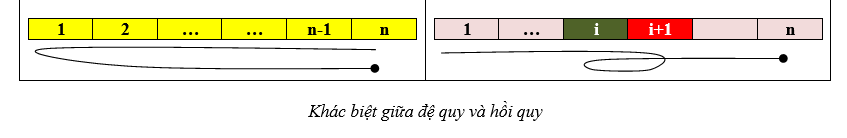
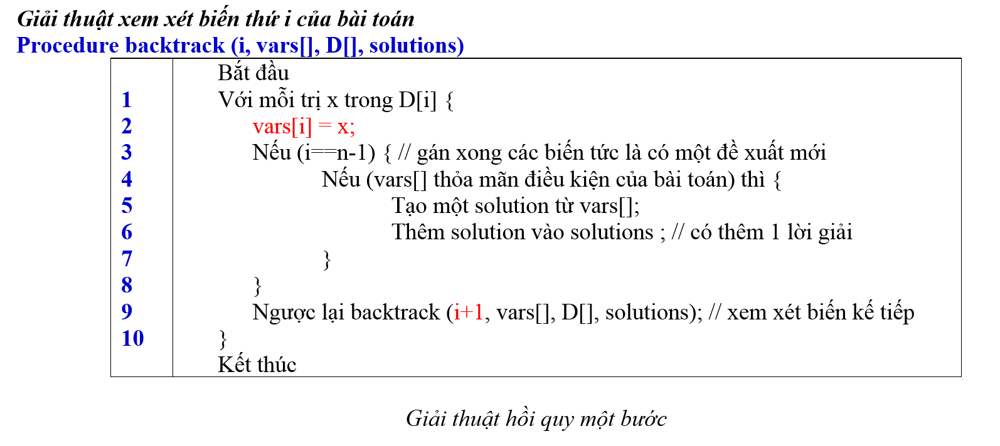
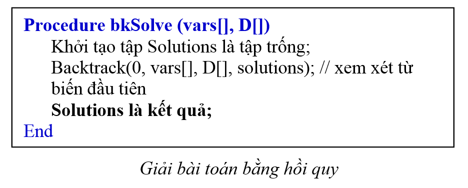
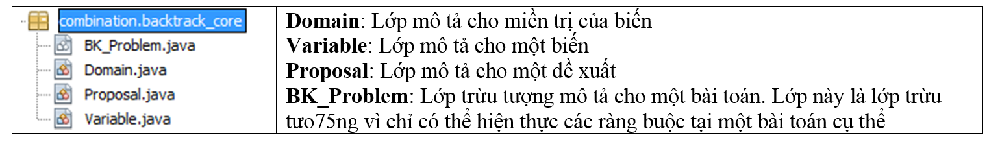

- **Redactor**: [Duc Dao](https://beacons.ai/ducdmd152)
- **Transform based on the material from Mr.SuTV.**

<aside>
💡 MODEL TO SOLVE PROBLEMS RELATED TO BACKTRACKING.

</aside>

<aside>
💡 1. Comments:

</aside>

- **A backtrack problem** often is a **combination problem.**

<aside>
💡 2. Definitions:

</aside>

- **Variable set:** is the set that contains variables that need to be assigned value ⇒ solving a problem is a task that finds and assigns proper values for variables.
- **Domain**: is set of value can assign for each variable.
- **Proposal**: is a tuple can assign into a variable set and expect that is a solution.
- **Space of a problem**: is the set of proposals that contains all solutions of the problem if exist.
- **Constraint of a problem**: conditions to accept a proposal.
- **Solution set**: proposals based on constraints of its problem.
    - More
        
        *In the AI field, the first goal is finding the first solution and then think about improving or finding a better algorithm.*
        

<aside>
💡 3. Evaluation:

</aside>

- Evaluating the complexity of a backtrack solving of a **combination problem.**
    - Time ~ O(M^N)
    - Space ~ O(N)
    
    *N is the number of variables in the problem.*
    
    *M is the average number of choices of each variable in the problem.*
    

<aside>
💡 4. Backtracking improvement:

</aside>

- Sort the order of variables in the set.
- Selected a proper order value for each variable, (*example: increase/decrease order*).

<aside>
💡 5. Implement backtracking:

</aside>

<aside>
💡 6. Backtracking Solving Model:

</aside>

- **BK_Problem** is an abstract class as a set of variable ⇒ backtracking solving as same as the task that we find accepted proposals for solutions.
- **Variable**: is a class that describes a variable including (value + its domain)
- **Domain:** is a class that describes a domain.
- **Proposal**: is a class as a set of values (we use a set of entities of Object class to accept for every type of values ⇒ polymorphism)

<aside>
💡 ⇒ When using the model we have some requirements:

- Initializing a specific class as a subclass of BK_Problem that describes a specific problem we need to solve.
- In that class, we need:
    - Overriding 2 methods: accepted() and accepted(index,value)
    - Build the contructor and initialize the set of variables in it.
</aside>

<aside>
💡 REFERENCES:

- Source code for the core of the model:
    
    [https://github.com/ducdmd152/java_combination_backtrack_model](https://github.com/ducdmd152/java_combination_backtrack_model)
    
- Documentation by Mr.SuTV:
    
    [QHD-ToHop-HoiQuy.docx](tài liệu thuộc quyền sở hữu của thầy giáo Mr.SuTV)
    
</aside>
